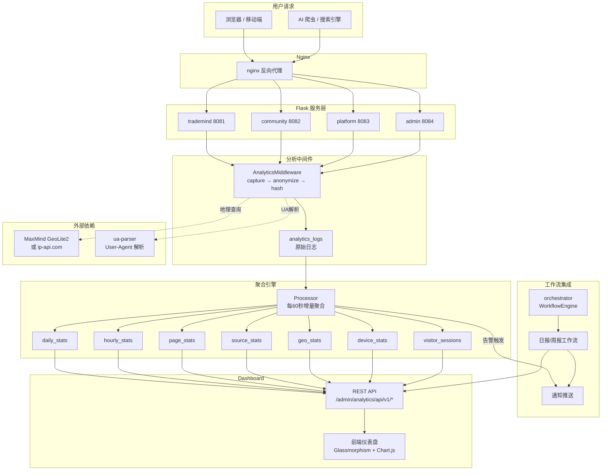
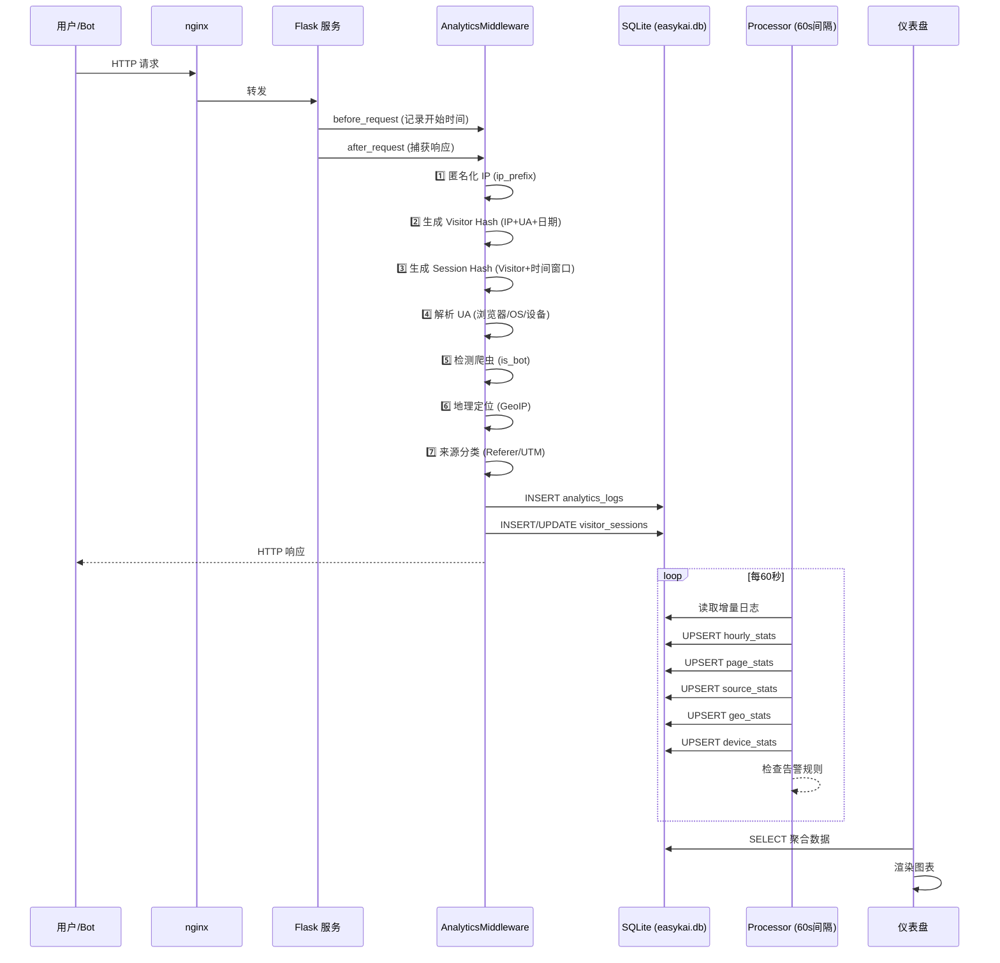
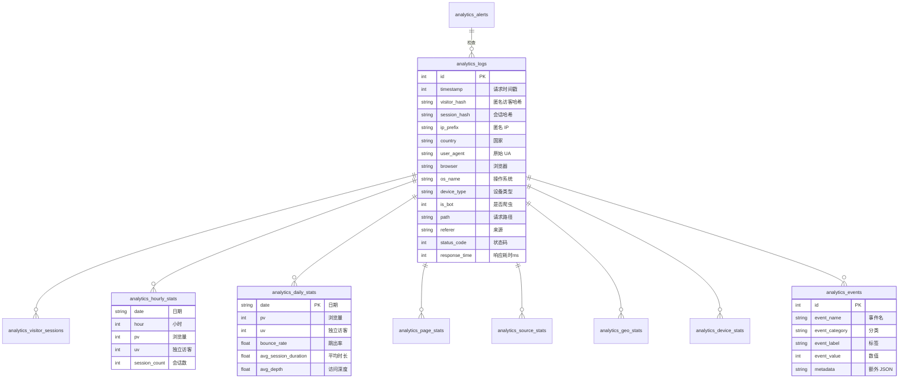

# EasyKai 网站统计分析系统 - 部署与集成指南

## 系统架构



## 数据流



## 数据库表关系



---

## 快速部署

### 第一步：安装依赖

```bash
# 本地开发机
cd ~/projects/易站智能
pip install geoip2 ua-parser user-agents

# 生产服务器
ssh easykai@100.124.0.103
pip install geoip2 ua-parser user-agents
```

### 第二步：上传分析模块

```bash
cd ~/projects/易站智能

# 上传整个 analytics 目录
scp -r analytics/ easykai@100.124.0.103:~/easykai-workspace/易站智能/

# 验证
ssh easykai@100.124.0.103 "ls -la ~/easykai-workspace/易站智能/analytics/"
```

### 第三步：初始化数据库表

```bash
ssh easykai@100.124.0.103
cd ~/easykai-workspace/易站智能
python3 -c "from analytics.models import init_analytics_tables; init_analytics_tables()"

# 验证表已创建
sqlite3 data/easykai.db ".tables" | grep analytics
# 应输出: analytics_alerts  analytics_logs  analytics_page_stats  ... (11张表)
```

### 第四步：集成到现有 Flask 服务

每个服务都需要注册中间件。以下是示例：

#### TMD(8081) / platform(8083) / community(8082) / admin(8084)

在每个 `app.py` 的 `import` 区和 `app = Flask(__name__)` 后添加：

```python
# === 分析系统 ===
# 在 import 区添加
sys.path.append(os.path.join(os.path.dirname(__file__), '..'))
from analytics.middleware import AnalyticsMiddleware

# 在 app 创建后、路由注册前添加
AnalyticsMiddleware(app, service_name='trademind')  # 根据服务改名字
```

**示例：修改 trademind/app.py**

```python
# 在文件顶部 import 区添加
sys.path.append(os.path.join(os.path.dirname(__file__), '..'))
from analytics.middleware import AnalyticsMiddleware

# 在 app = Flask(__name__) 之后、路由注册之前
AnalyticsMiddleware(app, service_name='trademind')
```

**示例：修改 admin/app.py**

```python
# 在 init_db() 之后、app.register_blueprint 之前
AnalyticsMiddleware(app, service_name='admin')
```

### 第五步：注册 Dashboard 蓝图

建议在 **admin 服务 (8084)** 中注册，这样访问 `agent.easykai.cn/admin/analytics` 即可:

```python
# admin/app.py 中，在注册其他 blueprint 时一并注册
# 在 app.register_blueprint(user_bp) 之后添加
from analytics.dashboard import analytics_bp
app.register_blueprint(analytics_bp)
```

### 第六步：启动聚合处理器

有两种方式：

**方式A：作为独立进程运行（推荐）**

```bash
# 在后台运行聚合守护进程
ssh easykai@100.124.0.103
cd ~/easykai-workspace/易站智能
nohup python3 -m analytics.cli daemon 60 > /tmp/analytics-processor.log 2>&1 &

# 查看日志
tail -f /tmp/analytics-processor.log
```

**方式B：集成到 admin 服务**

在 `admin/app.py` 中，在 `init_automation()` 后添加：

```python
# 启动分析处理器后台线程
from analytics.processor import AnalyticsProcessor
_analytics_processor = AnalyticsProcessor()
import threading
def _run_processor():
    import time
    while True:
        try:
            _analytics_processor.process()
        except Exception as e:
            print(f'[Analytics] ❌ {e}')
        time.sleep(60)
_t = threading.Thread(target=_run_processor, daemon=True)
_t.start()
```

### 第七步：验证部署

```bash
# 1. 检查中间件注册日志
curl -s http://127.0.0.1:8081/health 2>/dev/null
# 检查启动日志中是否有 [Analytics] ✅ 中间件已注册 [trademind]

# 2. 产生几条测试请求
curl -s -o /dev/null http://127.0.0.1:8081/
curl -s -o /dev/null http://127.0.0.1:8083/
curl -s -o /dev/null http://127.0.0.1:8084/admin

# 3. 检查原始日志是否写入
sqlite3 ~/easykai-workspace/易站智能/data/easykai.db \
  "SELECT COUNT(*) FROM analytics_logs"

# 4. 访问 Dashboard
# 浏览器打开: https://agent.easykai.cn/admin/analytics
# 或通过管理后台链接访问

# 5. 检查 API
curl -s https://agent.easykai.cn/admin/analytics/api/v1/realtime | python3 -m json.tool
curl -s https://agent.easykai.cn/admin/analytics/api/v1/stats | python3 -m json.tool
```

---

## Workflow 集成

### 注册分析节点处理器

在 `admin/app.py` 的 `init_automation(app)` 调用后添加：

```python
# 注册分析工作流节点
from analytics.workflow_nodes import register_analytics_handlers
register_analytics_handlers(_worker_pool.workflow_engine)
```

### 创建预设工作流

```bash
# 通过 CLI 创建日报/周报工作流
cd ~/easykai-workspace/易站智能
python3 -m analytics.cli seed-workflows

# 这将在管理后台 ⚡自动调度 中创建:
# - 📊 每日分析报告 (每天8:00自动运行)
# - 📊 每周运营报告 (每周一9:00自动运行)
```

### 手动创建 Workflow（通过 API）

```bash
# 创建一个分析报告工作流
curl -X POST https://agent.easykai.cn/admin/automation/workflows \
  -H "Authorization: Bearer YOUR_ADMIN_TOKEN" \
  -H "Content-Type: application/json" \
  -d '{
    "name": "📊 手动分析报告",
    "description": "即时生成分析报告",
    "definition": {
      "nodes": [
        {
          "id": "report",
          "type": "analytics_report",
          "name": "生成分析报告",
          "config": {"days": 7, "report_type": "full", "output": "text"}
        },
        {
          "id": "notify",
          "type": "notify",
          "name": "推送报告",
          "config": {
            "channels": ["notification"],
            "title": "📊 分析报告"
          }
        }
      ],
      "edges": [
        {"from": "report", "to": "notify"}
      ]
    }
  }'
```

---

## 将分析系统集成到管理后台导航

在 `admin/templates/admin.html` 的 NAV 数组中添加：

```javascript
// 在 NAV 数组中（约第20行）添加
["analytics", "📊", "统计分析", ""]
```

然后在 `l_analytics` 函数中添加 iframe 或导航到 `/admin/analytics`：

```javascript
// 注意：这是一个独立页面，使用 iframe 嵌入
window.l_analytics = function() {
  setContent('<iframe src="/admin/analytics" style="width:100%;height:calc(100vh - 120px);border:none;background:var(--bg-deep)"></iframe>');
}
```

---

## 自定义事件追踪

### 在代码中追踪事件

```python
# 在任何 Flask 路由或服务中
from analytics.tracker import track_event, track_agent_action

@app.route('/api/agent/launch')
def launch_agent():
    # ... 启动 Agent 的逻辑 ...
    
    # 追踪事件
    track_event(
        event_name='launch_agent',
        category='agent',
        label='hermes',
        path='/api/agent/launch',
        service_name='trademind',
        metadata={'agent': 'hermes', 'model': 'qwen-turbo'}
    )
    return jsonify({'success': True})
```

### 通过 API 追踪

```bash
curl -X POST https://agent.easykai.cn/admin/analytics/api/v1/event \
  -H "Content-Type: application/json" \
  -d '{
    "event_name": "launch_agent",
    "category": "agent",
    "label": "hermes",
    "path": "/dashboard",
    "metadata": {"version": "1.0"}
  }'
```

---

## 隐私配置

浏览器访问 `https://agent.easykai.cn/admin/analytics` → 告警 Tab 旁或通过 API:

```bash
# 查看当前隐私配置
curl -s https://agent.easykai.cn/admin/analytics/api/v1/privacy | python3 -m json.tool

# 修改日志保留天数
curl -X PUT https://agent.easykai.cn/admin/analytics/api/v1/privacy \
  -H "Authorization: Bearer YOUR_ADMIN_TOKEN" \
  -H "Content-Type: application/json" \
  -d '{"log_retention_days": "14"}'

# 关闭地理分析
curl -X PUT ... -d '{"geo_analysis_enabled": "false"}'
```

配置项说明：

| Key | 默认值 | 说明 |
|-----|--------|------|
| `ip_anonymization` | `true` | IP 匿名化开关 |
| `geo_analysis_enabled` | `true` | 地理分析开关 |
| `log_retention_days` | `30` | 原始日志保留天数 |
| `aggregation_retention_days` | `365` | 聚合数据保留天数 |
| `track_bots` | `true` | 是否记录爬虫 |
| `exclude_internal_ips` | `true` | 排除内部 IP |
| `exclude_paths` | JSON 数组 | 不记录的路径 |

---

## API 接口清单

| 端点 | 方法 | 说明 |
|------|------|------|
| `/admin/analytics/` | GET | 仪表盘页面 |
| `/admin/analytics/api/v1/realtime` | GET | 实时概览 |
| `/admin/analytics/api/v1/trend?days=30` | GET | 流量趋势 |
| `/admin/analytics/api/v1/hourly?date=` | GET | 小时级数据 |
| `/admin/analytics/api/v1/pages?days=30` | GET | 页面排行 |
| `/admin/analytics/api/v1/sources?days=30` | GET | 来源分析 |
| `/admin/analytics/api/v1/geo?days=30` | GET | 地理分布 |
| `/admin/analytics/api/v1/devices?days=30` | GET | 设备分布 |
| `/admin/analytics/api/v1/events?days=30` | GET | 事件统计 |
| `/admin/analytics/api/v1/overview?days=30` | GET | 综合概览 |
| `/admin/analytics/api/v1/stats` | GET | 系统自身统计 |
| `/admin/analytics/api/v1/export?type=trend` | GET | CSV 导出 |
| `/admin/analytics/api/v1/report?days=7` | GET | 报告 JSON |
| `/admin/analytics/api/v1/report/text` | GET | 报告文字版 |
| `/admin/analytics/api/v1/log` | POST | 记录日志 |
| `/admin/analytics/api/v1/event` | POST | 记录事件 |
| `/admin/analytics/api/v1/alerts` | GET/POST | 告警列表/创建 |
| `/admin/analytics/api/v1/alerts/<id>` | PUT/DELETE | 更新/删除告警 |
| `/admin/analytics/api/v1/privacy` | GET/PUT | 隐私配置 |
| `/admin/analytics/api/v1/cleanup` | POST | 手动清理日志 |

---

## 升级到 ClickHouse（生产规模）

当原始日志量超过 100 万条/天时，建议升级：

1. 安装 ClickHouse
2. 创建对应表结构（类似 SQLite schema）
3. 修改 `analytics/models.py` 的 `get_db()` 返回 ClickHouse 连接
4. 修改聚合查询使用 ClickHouse 的 AggregatingMergeTree

保留现有 SQLite 存储层作为灵活回退。

---

## 故障排查

| 症状 | 原因 | 解决 |
|------|------|------|
| Dashboard 显示 "--" | 中间件未注册或处理器未运行 | 检查启动日志中是否有 `[Analytics] ✅` |
| 只有爬虫数据 | GeoIP 未配置，ip-api 限流 | 下载 GeoLite2 数据库 |
| 数据不更新 | 处理器进程未运行 | 运行 `python3 -m analytics.cli daemon` |
| 报警没触发 | alert 规则 enabled=0 | 通过 API 设置 enabled=true |
| DB 太大 | log_retention_days 太长 | 调整隐私配置或手动 cleanup |
| 找不到路径 | 服务未注册 analytics_bp | 检查 app.register_blueprint(analytics_bp) |
| API 返回 500 | `sys.path` 未正确设置 | 确保 `sys.path.append` 指向 auth-center |

---

## 文件清单

```
analytics/
├── __init__.py              # 包说明
├── models.py                # 11 张表 + 完整 CRUD (41728 字节)
├── middleware.py             # Flask 请求捕获中间件 (16077 字节)
├── processor.py             # 聚合处理器 (15631 字节)
├── tracker.py               # 事件追踪 + 告警引擎 (10286 字节)
├── geoip.py                 # MaxMind GeoIP2 + ip-api 回退 (4965 字节)
├── ua_parser.py             # User-Agent 解析 (5178 字节)
├── dashboard.py             # Flask Blueprint + 18 个 API (14719 字节)
├── workflow_nodes.py        # Workflow 6 种节点处理器 (12476 字节)
├── cli.py                   # CLI 维护工具 (8339 字节)
├── templates/
│   └── analytics.html       # 前端仪表盘 (44042 字节)
└── static/
    (预留 JS/CSS 扩展)
```
