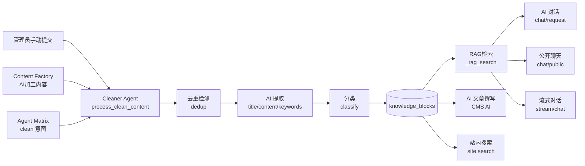

# 知识库 & 数据清洗系统（Knowledge & Cleaner Agent）

> **文档版本**: v1.0 · 最后更新: 2026-06-27  
> **所属项目**: [易站智能建站系统（easykai.cn）](https://easykai.cn)

---

## 一、概述（Overview）

知识库（Knowledge Base）是易站智能的**全局知识存储**，以 `knowledge_blocks` 表为核心，为全站所有 AI 功能提供结构化的知识供给。数据清洗智能体（Cleaner Agent）负责将**原始文本**清洗为**标准化的知识条目**，是知识库的核心数据入口。

### 知识流通全景



---

## 二、数据库（Database）

### 2.1 `knowledge_blocks` — 知识块主表

所有 AI 功能共享的知识条目存储。每条知识是一个**原子化**的内容块，带分类和优先级标记。

| 字段 | 类型 | 说明 |
|------|------|------|
| `id` | TEXT PK | 格式: `kb_{类型}_{序号}_{标题}`（如 `kb_company_001_公司基本信息`） |
| `title` | TEXT NOT NULL | 标题（最多 200 字） |
| `content` | TEXT NOT NULL | 正文内容（已去噪格式化） |
| `keywords` | TEXT | 关键词（逗号分隔，5-10 个） |
| `category` | TEXT | 分类标签: `company` / `product` / `price` / `tech` / `service` / `faq` / `industry` |
| `priority` | INTEGER | 优先级（10 最高，默认 5），影响 RAG 排序权重 |
| `created_at` | TEXT | 创建时间，格式 `datetime('now','localtime')` |

**索引**: `idx_kb_category` — 分类查询加速

**种子数据**: 约 26 条，覆盖公司信息、产品功能、FAQ、白皮书，通过数据库迁移（`database.py`）在首次运行时自动插入。

**定义位置**:  
[file:///F:/Sites/EasyKaiSite/auth-center/models/database.py](file:///F:/Sites/EasyKaiSite/auth-center/models/database.py) (第 1540-1604 行)

### 2.2 `knowledge_queue` — 清洗任务队列

记录每一条进入清洗管道的原始内容及其处理状态。

| 字段 | 类型 | 说明 |
|------|------|------|
| `id` | INTEGER PK | 自增主键 |
| `source` | TEXT | 来源: `manual` / `matrix` / `content_factory` |
| `raw_content` | TEXT NOT NULL | 原始内容（最长 50000 字符） |
| `status` | TEXT | 状态: `pending` → `cleaning` → `done` / `failed` |
| `cleaned_id` | TEXT | 清洗结果 ID（关联 `knowledge_blocks.id` 或 `'duplicate'`） |
| `error_msg` | TEXT | 失败原因 |
| `admin_id` | INTEGER | 提交管理员 ID |
| `created_at` | TEXT | 入队时间 |

**索引**: `idx_kq_status` — 按状态筛选加速

---

## 三、Cleaner Agent — 数据清洗智能体

### 3.1 核心文件

[file:///F:/Sites/EasyKaiSite/auth-center/routes/cleaner_agent.py](file:///F:/Sites/EasyKaiSite/auth-center/routes/cleaner_agent.py) (296 行)

### 3.2 处理流水线（Pipeline）

```
原始文本 → 截断(≤50000字) → 去重检测 → AI 提取 → 分类 → knowledge_blocks 写入
                                                      ↘ 队列状态更新
```

**步骤详解**:

1. **截断校验**: 空内容直接返回错误，超过 50000 字自动截断
2. **去重检测**: 读取所有已有标题（小写去重），传给 LLM 判断相似度 > 85% 时标记 `is_duplicate: true`
3. **AI 提取**: 调用 LLM（OpenAI 兼容接口），提取标题、正文（去噪）、分类、关键词
4. **写入**: 生成 `kb_id`（格式 `kb_cleaner_{queue_id}_{标题拼音}`），INSERT 到 `knowledge_blocks`
5. **队列记录**: 每次清洗在 `knowledge_queue` 表记录明细，状态追踪

### 3.3 核心函数

**`process_clean_content(raw_content, admin_id=0) → dict`**

所有调用路径的最终入口。返回结构：

```python
{
    'success': True/False,
    'kb_id': 'kb_cleaner_...' 或 'duplicate'（重复时）,
    'title': '...',
    'category': 'company|product|...',
    'keywords': '...',
    'message': '清洗完成/检测到重复/...'
}
```

### 3.4 AI 配置（system_config）

Cleaner Agent 通过 `system_config` 表读取 LLM 配置，支持独立设置或回退到全局 AI Key：

| system_config key | 默认值 | 说明 |
|-------------------|--------|------|
| `cleaner_ai_provider` | `deepseek` | AI 供应商标识 |
| `cleaner_ai_model` | `deepseek-chat` | 模型名称 |
| `cleaner_ai_base_url` | `https://api.deepseek.com` | API 端点 |
| `cleaner_ai_api_key` | — | 专用 API Key（优先） |

**回退链**: `cleaner_ai_api_key` → `{provider}_api_key`（如 `deepseek_api_key`）→ `{PROVIDER}_API_KEY` 环境变量

### 3.5 Agent Matrix 自动注册

首次运行时调用 `auto_register_sub_agent()`，在 Agent Matrix 中注册为子 Agent：

| 属性 | 值 |
|------|-----|
| 名称 | `Data Cleaner Agent` |
| 角色类型 | `sub` |
| 领域 | `cleaner` |
| 管理模块 | `knowledge` |
| 能力 | `text_clean`, `content_classify`, `dedup` |

---

## 四、三种调用路径（3 Call Paths）

### 路径 1: 管理后台手动提交（Admin API）

```
POST /shop/cleaner/submit
```

管理员通过管理后台 UI 直接粘贴原始内容，触发清洗。端点在 `cleaner_bp`（Blueprint 前缀 `/shop/cleaner`）中注册。

**配套 API**:
- `GET /shop/cleaner/list?status=` — 查看队列
- `POST /shop/cleaner/run/<id>` — 重跑单条
- `POST /shop/cleaner/run-all` — 批量重跑全部待处理项
- `GET /shop/cleaner/config` — 查看当前 AI 配置

### 路径 2: 内容工厂自动推送（Content Factory）

```
POST /admin/content-factory/push-to-knowledge
```

内容工厂（Content Factory）对 RSS 采集内容进行 AI 加工后，可将加工结果一键推送到知识库。在 `content_factory.py`（第 670 行）中实现：

1. 从 `processed_contents` 表读取已加工内容
2. 拼装为 `"标题：...\n关键词：...\n正文：..."` 格式
3. 调用 `process_clean_content()`

**详见**: [file:///F:/Sites/EasyKaiSite/auth-center/routes/content_factory.py](file:///F:/Sites/EasyKaiSite/auth-center/routes/content_factory.py) (第 670-696 行)

### 路径 3: 智能体矩阵意图路由（Agent Matrix）

```
POST /admin/agent-matrix/chat/tool  →  intent: "clean"
```

当用户在 AI 聊天中发送需要清洗的原始内容（如文章、白皮书、行业背景），Master Agent 的意图分析器识别 `intent: "clean"`，自动调用 `process_clean_content()`。

**详见**: [file:///F:/Sites/EasyKaiSite/agent_matrix/routes.py](file:///F:/Sites/EasyKaiSite/agent_matrix/routes.py) (第 471-489 行)

---

## 五、知识库消费（Knowledge Consumption）

### 5.1 RAG 检索机制

知识库通过混合关键词检索（**非向量 RAG**）为 AI 对话提供上下文增强。检索函数 `_rag_search(query, top_k=5, category=None)` 实现于：

[file:///F:/Sites/EasyKaiSite/platform/routes/api_v1.py](file:///F:/Sites/EasyKaiSite/platform/routes/api_v1.py) (第 44-95 行)

**评分算法**（总分 1.0+）:

| 维度 | 权重 | 计算方式 |
|------|------|---------|
| 关键词匹配 | 0.60 | 查询命中关键词的比例 |
| 字符重叠 | 0.25 | 查询与正文的字符交集比例 |
| 标题重叠 | 0.15 | 查询与标题的字符交集比例 |
| 精确命中正文 | +0.30 | 查询字符串在正文中出现 |
| 精确命中标题 | +0.20 | 查询字符串在标题中出现 |

结果按评分降序排列，返回前 `top_k` 条（最多 20）。

### 5.2 消费端（Consumers）

| 消费者 | 端点 | 说明 |
|--------|------|------|
| AI 对话（已登录） | `POST /api/v1/chat/request` | 自动注入 RAG 结果到 system prompt，`skip_rag` 可跳过 |
| 公开对话（商务机器人） | `POST /api/v1/chat/public` | 官网/抖音小程序用户，带限流，同样注入 RAG |
| 流式对话 | `POST /api/v1/chat/stream` | SSE 流式输出，带 RAG |
| Agent Matrix 聊天 | `POST /admin/agent-matrix/chat/stream` | 读取 `chatbot_knowledge_base` 系统配置作为知识源 |
| CMS AI 文章撰写 | 内容编辑器 AI 辅助 | 引用知识库内容辅助文章生成 |
| 站内搜索 | `POST /api/v1/knowledge/list` | 用户端知识库列表查询（分页、关键词筛选、分类筛选） |

### 5.3 知识库与聊天机器人的关系

目前知识库通过以下方式供给聊天机器人：

- **Platform API 聊天**: 自动调用 `_rag_search` 注入最多 5 条相关知识的拼接文段。
- **Agent Matrix 聊天**: 读取 `system_config` 中的 `chatbot_knowledge_base` 键值作为静态知识源，该值需要**手动维护**，不与 `knowledge_blocks` 自动同步。
- **社区聊天机器人**: 使用独立的 `faq.json` 和 `easykai_faq.md`，与 `knowledge_blocks` 互不干扰。

> ⚠️ Agent Matrix 聊天与 `knowledge_blocks` 之间目前无自动同步管道。两者之间的打通为**待优化项**。

---

## 六、文件索引（File Index）

| 文件 | 说明 |
|------|------|
| [auth-center/routes/cleaner_agent.py](file:///F:/Sites/EasyKaiSite/auth-center/routes/cleaner_agent.py) | Cleaner Agent 核心逻辑 + API 端点 |
| [auth-center/models/database.py](file:///F:/Sites/EasyKaiSite/auth-center/models/database.py) | `knowledge_blocks` + `knowledge_queue` 表定义（第 1540-1604 行） |
| [auth-center/routes/content_factory.py](file:///F:/Sites/EasyKaiSite/auth-center/routes/content_factory.py) | Content Factory → 知识库推送（第 670 行） |
| [agent_matrix/routes.py](file:///F:/Sites/EasyKaiSite/agent_matrix/routes.py) | Agent Matrix clean 意图路由（第 471 行） |
| [platform/routes/api_v1.py](file:///F:/Sites/EasyKaiSite/platform/routes/api_v1.py) | RAG 检索 + AI 对话注入（第 44 行） |
| [data/seed_knowledge_blocks.sql](file:///F:/Sites/EasyKaiSite/data/seed_knowledge_blocks.sql) | 种子数据 SQL 脚本 |
| [docs/content-factory.md](file:///F:/Sites/EasyKaiSite/docs/content-factory.md) | 内容工厂文档 |
| [docs/agent-matrix.md](file:///F:/Sites/EasyKaiSite/docs/agent-matrix.md) | 智能体矩阵文档（含 Clean intent 说明） |

---

## 七、统计信息（Statistics）

| 指标 | 数值 | 说明 |
|------|------|------|
| `knowledge_blocks` 总条数 | ~26（种子）+ 清洗入库 | 首次迁移插入 20 条种子 + 6 条 FAQ 种子 |
| `knowledge_queue` 条目 | 由使用量决定 | 每次清洗操作产生一条记录 |
| 分类覆盖 | 7 类 | company / product / price / tech / service / faq / industry |
| 支持 AI 供应商 | 4 种 | DeepSeek（默认）/ DashScope / OpenAI / OpenRouter |
| 调用路径 | 3 条 | 管理员提交 / 内容工厂 / Agent Matrix |
| 清洗超时 | 4096 tokens | LLM 单次 max_tokens 限制 |
| 原始内容上限 | 50000 字 | 前端截断 |
| 去重参考上限 | 50 条 | 传递给 LLM 的已有标题数量 |
